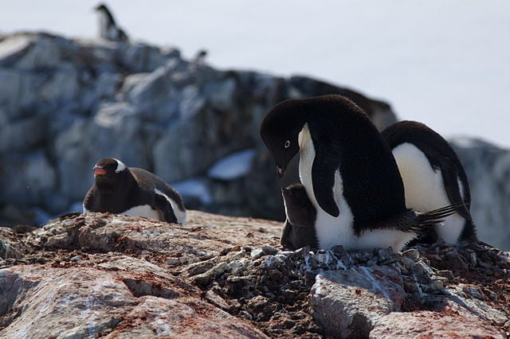

```{r setup, include=FALSE}
knitr::opts_chunk$set(echo = TRUE)
SciViews::R(___)
```

# Introduction

Trois espèces de manchots ont été étudiée en Antarctique entre 2007 et 2009 par le Docteur Kristen Gorman de la base scientifique Palmer. Les manchots ont été observé sur l'île du Rêve (`Dream`), sur l'île de Torgersen (`Torgersen`) et sur l'île Biscoe (`Biscoe`). Les espèces étudiées sont le manchot Papou *Pygoscelis papua* (Forster, 1781), `Gentoo`, le manchot Adélie *Pygoscelis adlidae* (Hombron & Jacquinot, 1841), `Adelie` et le manchot à jugulaire *Pygoscelis antarcticus* (Forster, 1781), `Chinstrap`.



Les chercheurs souhaitent mettre en évidence la différence de masse entre les trois espèces de manchots et tenant compte du sexe des individus.

# Analyse

```{r peng_skim, echo=TRUE}
penguins <- read("penguins", package = "palmerpenguins")
skimr::skim(penguins)
```

<!--% Décrivez en 2 à 3 phrases le tableau de données. Intéressez-vous aux valeurs manquantes, aux unités des variables... -->

<!--% Réalisez ensuite un tableau permettant de comparer la moyenne, l'écart-type des masses et le nombre d'observations pour chaque espèce et chaque sexe. Interprétez ensuite ce tableau en maximum 3 phrases en dessous de lui. -->

```{r peng_tab}
penguins %>.%
  ___ %->%
  peng_tab
peng_tab 

# Ne modifiez pas ci-dessous
write$rds(peng_tab, here::here("tests", "peng_tab.rds"), compress = "xz")
```

<!--% Réalisez un graphique permettant de visualiser la comparaison entre les trois espèces et le sexe. Commentez ensuite ce graphique en maximum 3 phrases en dessous. -->

```{r peng_plot}
penguins %>.%
  ___ %->%
  peng_plot
peng_plot

# Ne modifiez pas ci-dessous
write$rds(peng_plot, here::here("tests", "peng_plot.rds"), compress = "xz")
```

<!--% Effectuez une ANOVA à deux facteurs. Déterminez si vous devez employer un modèle complet ou un modèle sans interactions. Décrivez et interprétez votre modèle en 3 phrases maximum en dessous. -->

```{r peng_anova1}
___(peng_lm1 <- ___)

# Ne modifiez pas ci-dessous
write$rds(peng_lm1, here::here("tests", "peng_lm1.rds"), compress = "xz")
```

<!--% Vérifiez l'homoscédasticité grâce à un test de Bartlett. Interprétez votre résultats en 2 phrases en dessous. -->

```{r peng_bartlett1}

```

<!--% Vérifiez la distribution Normale des résidus de votre modèle. Interprétez votre analyse en maximum 2 phrases en dessous. -->

```{r peng_resid1}

```

<!--% Le test de comparaison multiple ne peut pas être employé lorsqu'il y a des interactions. Une solution est de créer une nouvelle variable qui groupe les deux variables facteurs en une seule. Faites-le et réalisez une ANOVA à un facteur ensuite. Interprétez ce que vous obtenez en 4 phrases maximum en dessous. -->

```{r peng_anova2}
___(peng_lm2 <- ___)

# Ne modifiez pas ci-dessous
write$rds(peng_lm2, here::here("tests", "peng_lm2.rds"), compress = "xz")
```

<!--% Vérifiez l'homoscédasticité des résidus de votre ANOVA à un facteur. Interprétez votre test en 2 phrases maximum en dessous. -->

```{r peng_bartlett2}

```

<!--% Vérifiez la distribution Normale des résidus de votre ANOVA à un facteurs. Sur cette base, indiquez si le modèle est utilisable et expliquez en 2 phrases maximum en dessous. -->

```{r peng_resid2}

```

<!--% Réalisez un test de comparaison multiple si cela se justifie. Interprétez vos résultats en 4 phrases maximum en dessous. -->

```{r peng_posthoc2}
summary(peng_posthoc2 <- ___)

# Ne modifiez pas ci-dessous
write$rds(peng_posthoc2, here::here("tests", "peng_posthoc2.rds"), compress = "xz")
```
